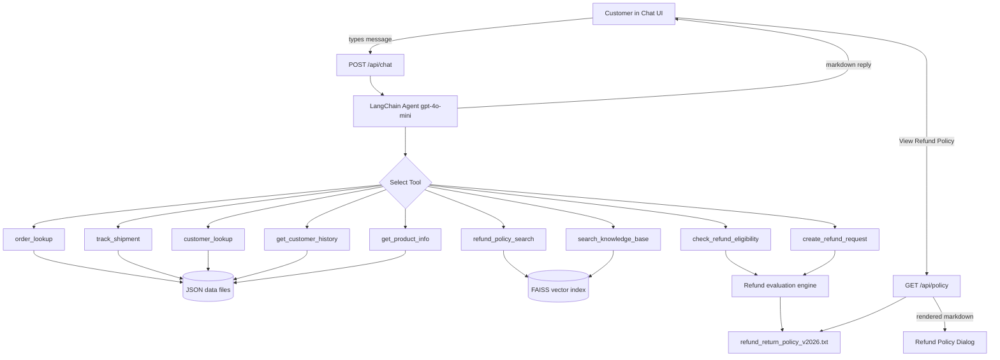
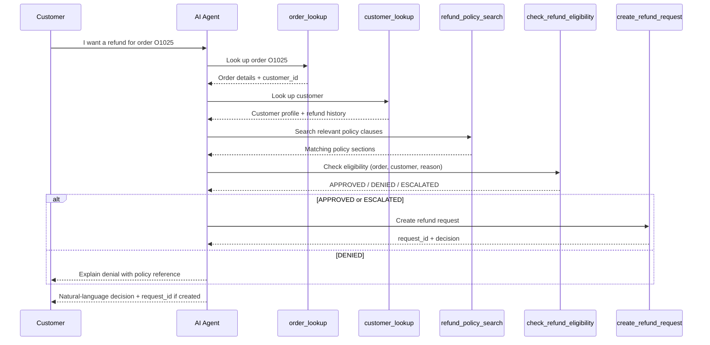

# FoundersMax Agent

Unified Next.js application combining the FoundersMax customer support chat UI and LangChain AI backend in a single project.

## Stack

- **Frontend:** Next.js App Router, React 19, plain CSS
- **Backend:** Next.js API routes (`/api/chat`, `/api/health`, `/api/policy`)
- **Agent:** LangChain JS + OpenAI (`gpt-4o-mini`) with 9 support tools
- **Data:** JSON order/product/customer files, in-memory refund store, FAISS vector search

## Setup

1. Install dependencies:

   ```bash
   npm install
   ```

2. Copy environment variables:

   ```bash
   cp .env.example .env.local
   ```

   Set `OPENAI_API_KEY` in `.env.local` (required for chat and vector embeddings).

3. Start the dev server:

   ```bash
   npm run dev
   ```

4. Open [http://localhost:3000](http://localhost:3000)

## Workflow Overview

The app is a customer-support agent that answers questions, looks up orders and customers, searches policy/FAQ documents, and processes refund requests according to company rules.



## End-to-End Request Flow

### 1. User sends a message

1. The user types in the chat input (or clicks a suggested prompt in the right sidebar).
2. `useChatSessions` sends a `POST` request to `/api/chat` with:
   - `message` — the user's text
   - `session_id` — optional UUID for conversation memory
3. The API route calls `runAgent()` in `lib/agent/agent.ts`.

### 2. Agent bootstraps and runs

On the first request, the agent:

- Loads customers and orders from JSON files (`initCustomers`, `initOrders`)
- Builds FAISS vector indexes for the refund policy and FAQ (requires `OPENAI_API_KEY`)
- Creates a LangChain agent with `gpt-4o-mini`, 9 tools, and a system prompt
- Uses `MemorySaver` to keep conversation history per `session_id`

The agent reads the system prompt (`lib/agent/prompt.ts`), decides which tools to call, and returns a natural-language response (rendered as markdown in the chat).

### 3. Tool routing by question type

| Customer asks about… | Tool(s) used |
|----------------------|--------------|
| Order details (items, total, dates) | `order_lookup` |
| Tracking / delivery status | `track_shipment` |
| Return windows, non-refundable items, escalation rules | `refund_policy_search` |
| Shipping times, payments, account help | `search_knowledge_base` |
| Customer profile | `customer_lookup` |
| Past orders and refund history | `get_customer_history` |
| Product warranty / specs | `get_product_info` |
| Refund request | See [Refund workflow](#refund-request-workflow) below |

### 4. Response back to the UI

The API returns:

```json
{
  "response": "…",
  "session_id": "uuid",
  "execution_log": ["tool calls and results…"]
}
```

- The assistant message is rendered with `react-markdown` in `MessageBubble`.
- The execution log is stored in the session and viewable via **View Backend Log** in the right sidebar.

## Refund Request Workflow

When a customer explicitly asks for a refund, the agent follows this sequence:



### Eligibility rules (enforced in `lib/services/refund-service.ts`)

The refund engine evaluates each request in order:

1. **Non-refundable items** — If the order contains Final Sale, clearance, gift card, digital, subscription, personalized, hygiene, or software license items → **DENIED**
2. **30-day window** — If delivery was more than 30 days ago → **DENIED**
3. **Fraud / escalation checks** — Order value > $500, > $1,000, or customer has > 3 refunds in 12 months → **ESCALATED**
4. **Approved reasons** — Damaged, defective, wrong item, lost in transit, fewer items, unused, not received → **APPROVED**
5. **Other reasons** → **DENIED**

### Refund outcomes

| Decision | Meaning | `create_refund_request` called? |
|----------|---------|--------------------------------|
| `APPROVED` | Refund will be processed | Yes — creates `RR-XXXXXXXX` request ID |
| `ESCALATED` | Needs human or manager review | Yes — request logged for review |
| `DENIED` | Does not meet policy | No — agent explains why |

## Viewing the Refund Policy (Markdown)

Users can read the full policy without chatting:

1. Open the **Info** panel (right sidebar).
2. Click **View Refund Policy**.
3. `RefundPolicyDialog` fetches `GET /api/policy`.
4. The policy file (`data/refund_return_policy_v2026.txt`) is returned and rendered as **markdown** using `react-markdown` — headings, lists, bold text, and tables are formatted for readability.

The same policy document powers:

- The **View Refund Policy** dialog (full document, markdown-rendered)
- The **`refund_policy_search`** tool (RAG semantic search over policy sections)
- The **refund evaluation engine** (hard-coded rules aligned with policy sections)

## API

| Method | Path | Description |
|--------|------|-------------|
| `GET` | `/api/health` | Health check |
| `POST` | `/api/chat` | Send a message to the support agent |
| `GET` | `/api/policy` | Return the full refund & return policy (markdown) |

**Chat request body:**

```json
{
  "message": "I want a refund for order O1025",
  "session_id": "optional-uuid-for-conversation-memory"
}
```

**Chat response:**

```json
{
  "response": "…",
  "session_id": "uuid",
  "execution_log": ["…"]
}
```

**Policy response:**

```json
{
  "policy": "# Refund & Return Policy v2026\n\n…"
}
```

## Project structure

```
foundermaxagent/
├── app/
│   ├── api/
│   │   ├── chat/route.ts      # Agent endpoint
│   │   ├── health/route.ts
│   │   └── policy/route.ts    # Refund policy document
│   ├── page.tsx               # Chat UI
│   └── globals.css
├── components/
│   ├── RefundPolicyDialog.tsx # Markdown policy viewer
│   ├── MessageBubble.tsx      # Markdown chat messages
│   ├── RightSidebar.tsx       # Policy + backend log access
│   └── …
├── hooks/useChatSessions.ts   # Session state + API calls
├── lib/
│   ├── agent/                 # LangChain agent + system prompt
│   ├── services/
│   │   ├── refund-service.ts  # Eligibility + request creation
│   │   ├── policy-service.ts  # Policy file + RAG search
│   │   ├── knowledge-service.ts
│   │   ├── order-service.ts
│   │   ├── customer-service.ts
│   │   └── …
│   └── tools/index.ts         # 9 agent tools
└── data/
    ├── refund_return_policy_v2026.txt  # Policy (markdown)
    ├── faq_knowledge_base.txt
    ├── orders.json
    ├── customers.json
    └── products.json
```

## Try it

Suggested prompts (available in the right sidebar):

- `I want a refund for order O1025`
- `What's the return policy for gift cards?`
- `Find customer C001`

## Notes

- FAISS indexes are built on startup via `instrumentation.ts` (or on first chat request).
- Session memory uses in-process LangGraph `MemorySaver` — works with `next dev` and `next start`.
- Refund requests are stored in memory for the server process lifetime (not persisted to SQLite).
- The original `backend/` and `frontend/` folders are unchanged; this project is a standalone migration.

## Scripts

- `npm run dev` — development server
- `npm run build` — production build
- `npm run start` — production server
- `npm run lint` — ESLint
